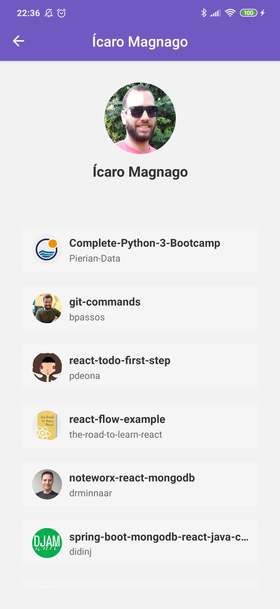
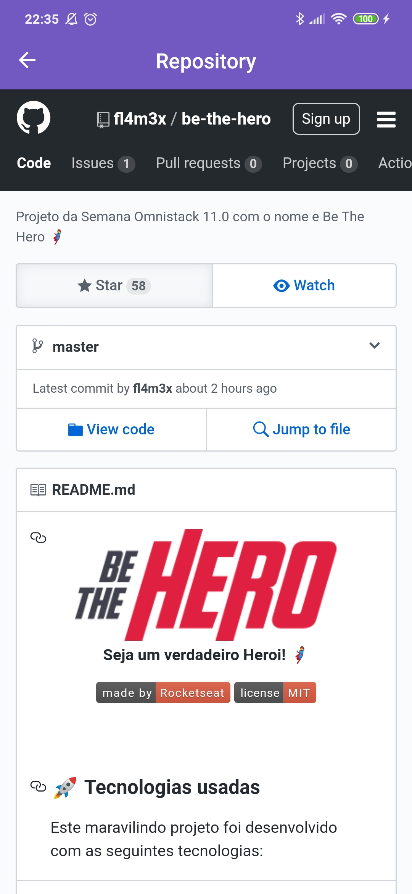

# react-native-list-starred-repo
Application to show starred repositories from GitHub using React Native

# Bootcamp GoStack - Challenger 06

Improvements in the app created during module 06 of the Rocketseat's Bootcamp GoStack.

 <br/>

 <br/>

 <br/>

# :computer: Tecnologies

<ul>
  <li><a href="https://reactnative.dev/?utm_source=jobhired.io">React Native</a></li>
  <li><a href="https://styled-components.com/docs/basics">Styled Components</a></li>
  <li><a href="https://github.com/axios/axios">Axios</a></li>
  <li><a href="https://www.npmjs.com/package/prop-types">Prop Types</a></li>
  <li><a href="https://reactnavigation.org/docs/getting-started/">React Navigation</a></li>
  <li><a href="https://reactnavigation.org/docs/hello-react-navigation">React Navigation Stack</a></li>
  <li><a href="https://github.com/infinitered/reactotron/blob/master/docs/quick-start-react-native.md">Reactotron</a></li>
</ul>

# Getting Started

Fisrt things first, install the the dependencies on directory using the command below:

```bash
yarn

```

<p>Follow the steps for install the React Native environment: https://docs.rocketseat.dev/ambiente-react-native/introducao</p>

<p>Now, run:</p>

```bash
react-native run-android

```

and

```bash
react-native start

```


## :memo: License

This project is under the MIT license. See [License](LICENSE.md) for more details.
